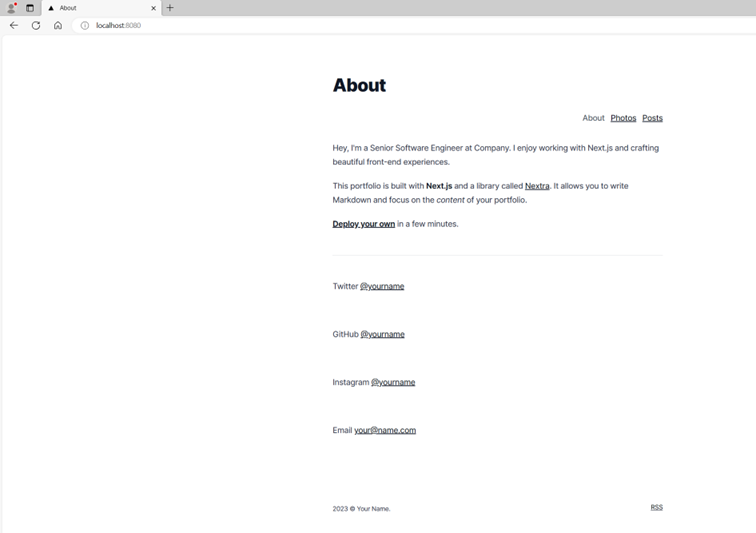
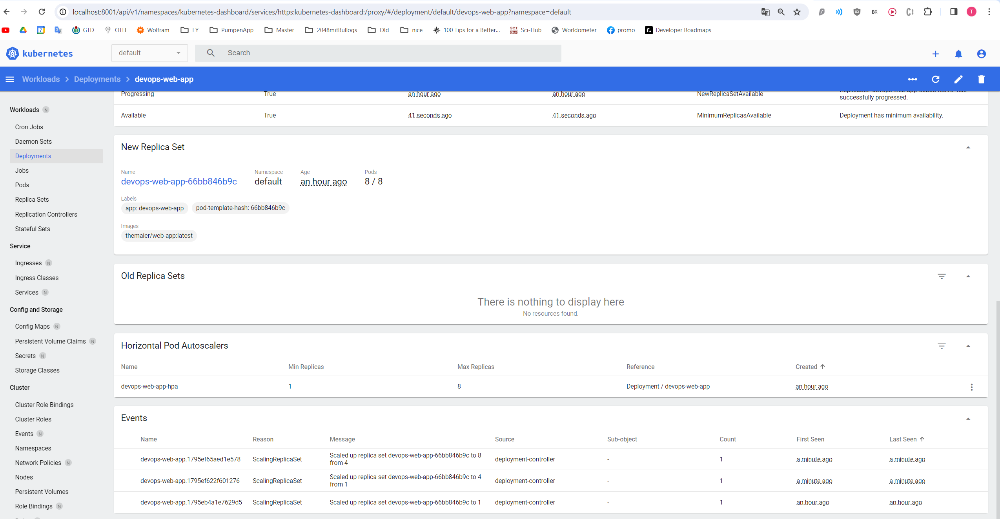
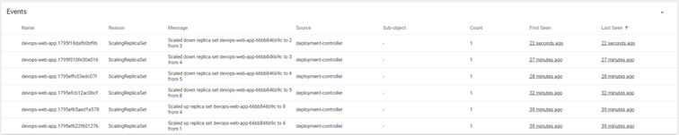

First i created a docker image and pushed it to dockerhub.
Then i created a kind cluster and added the docker image.
With portforwarding i can access the next.js app on localhost:8080.
Then i added a Kubernetes dashboard to monitor the load.
Then i 

**-----------Setup-----------**

**Create Cluster:**
kind create cluster
<!-- docker build -t themaier/web-app . -->
kind load docker-image themaier/web-app
kubectl apply -f assignment2/deployment.yml
kubectl apply -f assignment2/service.yml
kubectl apply -f assignment2/hpa.yml

**Access Cluster:**
<!-- kubectl get svc devops-web-app-service -->
kubectl port-forward service/devops-web-app-service 8080:3000
http://localhost:8080/

**Kubernetes Dashboard:**
<!-- download and apply dashboard -->
kubectl apply -f https://raw.githubusercontent.com/kubernetes/dashboard/v2.7.0/aio/deploy/recommended.yaml
<!-- add admin user -->
kubectl apply -f assignment2/dashboard_account.yml
<!-- create token -->
kubectl -n kubernetes-dashboard create token admin-user
<!-- start dashboard -->
kubectl proxy
<!-- access dashboard -->
<!-- copy token and open link -->
http://localhost:8001/api/v1/namespaces/kubernetes-dashboard/services/https:kubernetes-dashboard:/proxy/

**Install metrics server:**
kubectl apply -f https://github.com/kubernetes-sigs/metrics-server/releases/latest/download/components.yaml
kubectl edit deployment metrics-server -n kube-system

<!-- add under conaiters.args -->
args:
- --kubelet-insecure-tls
- --kubelet-preferred-address-types=InternalIP

**Generate load:**
kubectl apply -f assignment2/busybox.yml
kubectl get svc 
<!-- extrac <cluster-ip> and left port (internal port -> 3000) -->
kubectl exec -it busybox-load-generator -- /bin/sh

while true; do
  wget -q -O- http://10.96.154.2:3000
  sleep 0.001
done

<!-- Strg + C to stop -->

**Info:**
kubectl get deployments devops-web-app
kubectl describe deployments devops-web-app

kubectl get replicasets
kubectl describe replicasets